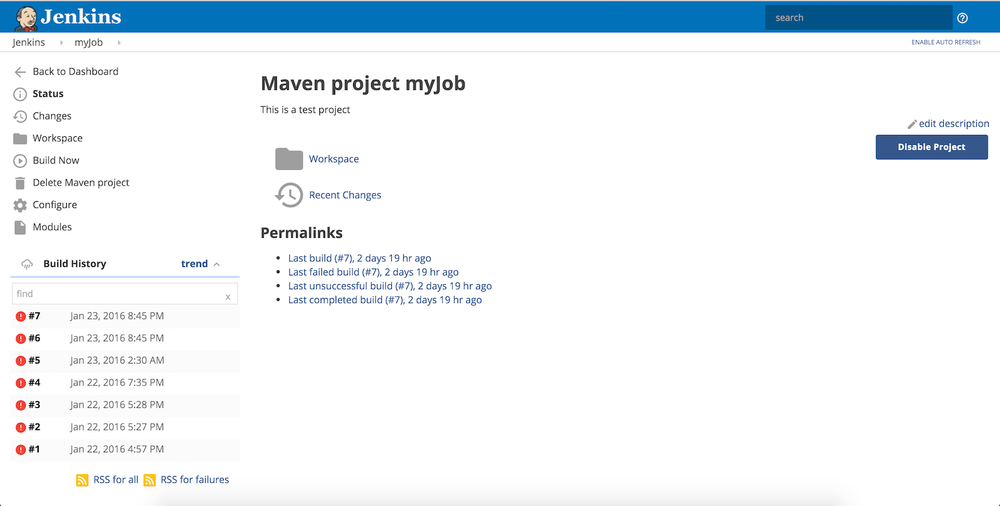
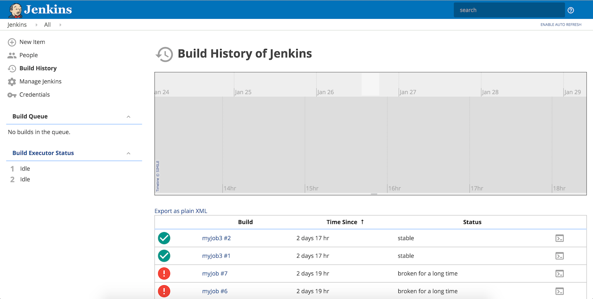
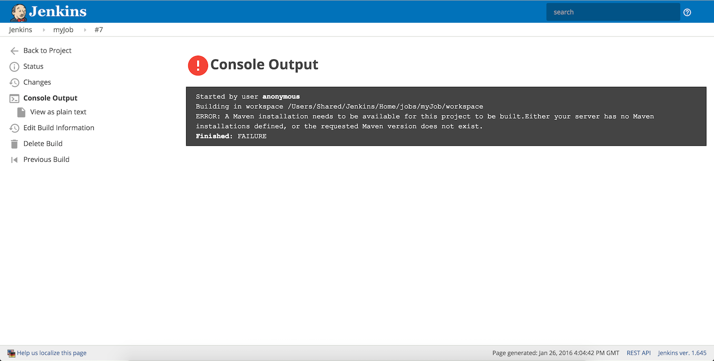

# jenkins-neo-theme
Beautify your Jenkins with the a modern flat theme!

Website: http://jenkins-contrib-themes.github.io/jenkins-neo-theme

So you love **Jenkins** but hate its ugly user interface and icons... Me too! Introducing **Jenkins Neo Theme**.

This started as a fork to **jenkins-material-theme**, but changed mostly to use a flat and minimalistic design.
 
## Features
* Just one small css file (35K)
* Embed minified SVG images
* Multiple ways to install

## Screenshots
          


## Installation 

### Using this GitHub page

1. Install [Jenkins Simple Theme Plugin][simple]

1. Click `Manage Jenkins`

1. Click `Configure System` and scroll down to `Theme`

1. Specify the URL for `http://jenkins-contrib-themes.github.io/jenkins-neo-theme/dist/neo-light.css`.

1. Click `Save`


### Using your Jenkins Hosting

1. Upload the file `http://jenkins-contrib-themes.github.io/jenkins-neo-theme/dist/neo-light.css` to your web server

1. Follow the steps of the previous method using your uploaded file as URL in step 4


### Using Stylish (only you will be able to see the awesome theme)

1. Install the [Stylish Chrome extension][stylish]

1. Copy the content of the file `http://jenkins-contrib-themes.github.io/jenkins-neo-theme/dist/neo-light.css`

1. Go to Stylish options and click in `Write new style`

1. Paste the theme css in the code box

1. Click in `Specify` and set your jenkins domain

1. Click in `Save`

1. Go to your Jenkins website and enable the theme in the Stylish Chrome toolbar icon


## Development

CSS file are minified and compressed with Grunt. To prepare the environment:

```
npm install
grunt
```

This will generate the following file:
- dist/neo-light.css
- dist/neo-dark.css

** Note: Theme neo-dark is WIP **

## Compatibility
- Simple Theme plugin 0.3
- Jenkins 1.636
- Firefox 3.5+
- Chrome 4+
- Safari 4+
- Opera 15+
- Microsoft IE11 and Edge


If you are experiencing issues please let me know! Also, feel free to contribute!

## License
http://aarjithn.mit-license.org/

##Thanks to
- [Jenkins material theme][material] for the inspiration and original work
- [Simple Theme Plugin][simple] for the Simple Theme plugin
- [Google][google] for the the material design inspiration and the icons
- [Material Design Icons][material-design-icons] for some extra icons
- [Stylish][stylish] for making the test of new versions easy
- [canon-jenkins][canon-jenkins] for the base theme
- [@Heldroe][heldroe] for Firefox and Microsoft support

[material]: https://github.com/afonsof/jenkins-material-theme
[simple]: https://wiki.jenkins-ci.org/display/JENKINS/Simple+Theme+Plugin
[google]: https://www.google.com/design/spec/material-design/introduction.html
[material-design-icons]: https://materialdesignicons.com/
[stylish]: https://chrome.google.com/webstore/detail/stylish/fjnbnpbmkenffdnngjfgmeleoegfcffe
[canon-jenkins]: https://github.com/rackerlabs/canon-jenkins
[heldroe]: https://github.com/Heldroe
